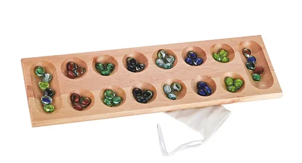
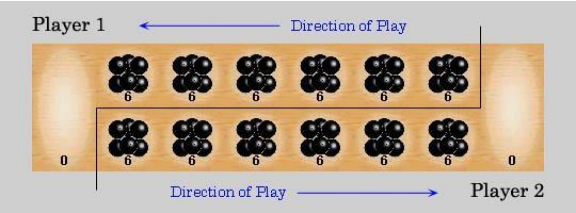
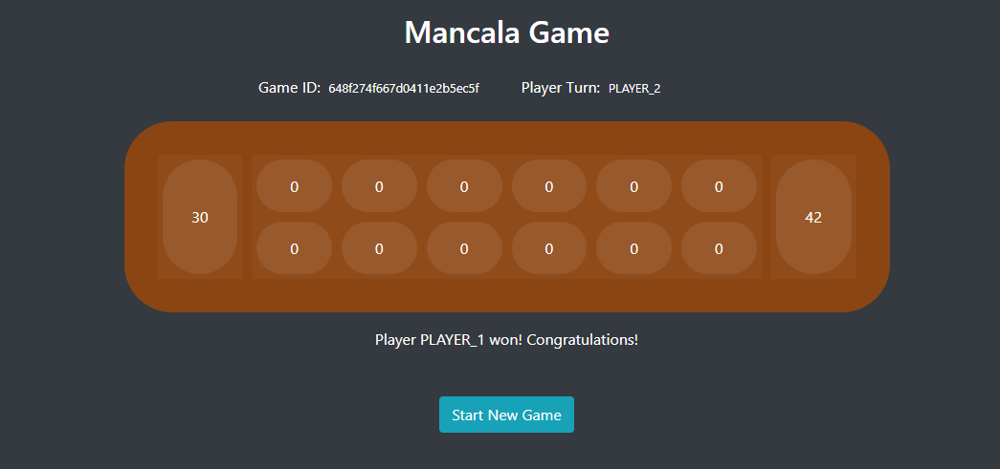

# Mancala Game Application
This app implements Mancala Game Front End based on Angular Framework.

# Game Description

### Board Setup
Each of the two players has his six pits in front of him. To the right of the six pits,
each player has a larger pit. At the start of the game, there are six stones in each
of the six round pits .

### Rules

#### Game Play
The player who begins with the first move picks up all the stones in any of his own
six pits, and sows the stones on to the right, one in each of the following pits,
including his own big pit. No stones are put in the opponents' big pit. If the player's
last stone lands in his own big pit, he gets another turn. This can be repeated
several times before it's the other player's turn.

#### Capturing Stones
During the game the pits are emptied on both sides. Always when the last stone
lands in an own empty pit, the player captures his own stone and all stones in the
opposite pit (the other player’s pit) and puts them in his own (big or little?) pit.

#### The Game Ends
The game is over as soon as one of the sides runs out of stones. The player who
still has stones in his pits keeps them and puts them in his big pit. The winner of
the game is the player who has the most stones in his big pit.

# UI Description

The solution uses [Back End API](https://github.com/ppnati33/mankala-game-api)

* A new game can be started by "Start New Game" button
* Any player can do a first move, the next turn will be calculated automatically based on first move pit position

## Run the app

Run `ng serve` for a dev server. Navigate to `http://localhost:4200/` to see the game board.

## Need further support?

Contact me if you need help at ppnati33@gmail.com
